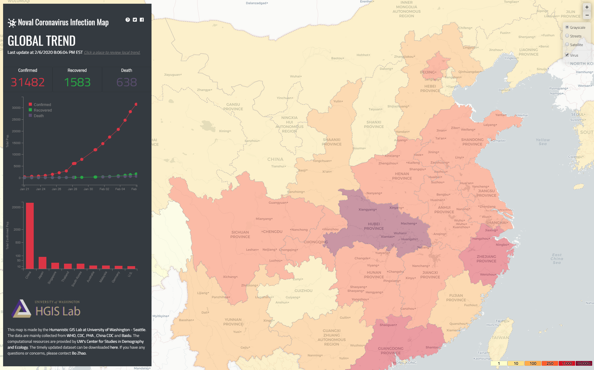
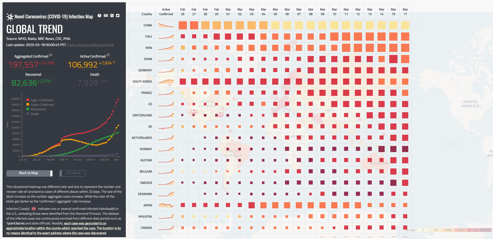

# COVID-19: Novel Coronavirus Infection Map

This repository stores the source code for the Novel Coronavirus Infection Map (https://hgis.uw.edu/virus). This online interactive map enables users to track both the global and local trends of Novel Coronavirus infection since Jan 21st, 2020. The dataset is timely collected from multiple official sources and then plotted onto this map.

## Choropleth Map:

In the main map, an country or region's inflection level is measured by the # of today's active/remaining confirmed cases. The gray slash texture indicates no previous cases are discovered; the green texture means the region in which all the infected cases have recovered.

Infection Case(s) (shown as human icon in red) indicates one or more confirmed infected individual(s) in the U.S. and Canada, excluding those were identified from the Diamond Princess. The dataset of the infected cases are continuously enriched from different data portals such as [1point3acres](https://coronavirus.1point3acres.com/en) and state officials. **Notably, each case was geocoded to an approximate location within the county which reported the case. The location is by no means identical to the exact address where the case was discovered.**

An Infected Community (shown as bed icon in red) indicates a community or village where confirmed cases were found. The local governments in China have taken strict measures to isolate the residents of these places from the outside. The dataset of infected community can be found at [ahusmart](https://lab.ahusmart.com/nCoV/api/detail).

## Situational Heatmap:

The situational heatmap focuses on incremental data and statistics on daily historical data. This heatmap shows the development of the epidemic, and helps to reveal the turning point of the COVID-19 epidemic. The size of each square indicates the change in the number of aggregate cases on that day from the previous day. Larger box means more cases confirmed in the region. The color of the square indicates the status of active cases. Darker colors indicate the increase in active cases and lighter colors indicate the decrease in active cases.

## Data Sources:
The data are mainly collected from:
- [National Health Commission](http://en.nhc.gov.cn/) (NHC) of the People’s Republic of China
- China’s Provincial & Municipal Health Commission
- China’s Provincial & Municipal government database
- Public data published from Hongkong, Macau and Taiwan official channels
- [World Health Organization](https://www.who.int/emergencies/diseases/novel-coronavirus-2019/situation-reports/) (WHO)
- [Centers for Disease Control and Prevention](https://www.cdc.gov/coronavirus/) (CDC)
- [Public Health Agency of Canada](https://www.canada.ca/en/public-health.html) (PHA)
- [Baidu](https://voice.baidu.com/act/newpneumonia/newpneumonia)
- [Mapmiao](https://mapmiao.com/ncov/)
- The dataset (in SQLite format) can be downloaded from http://hgis.uw.edu/virus/assets/virus.db.
- You can view the data (in CSV format) at http://hgis.uw.edu/virus/assets/virus.csv.

> **Note:** In the data table, each entry indicates the infection status in the format of `#-#-#-#` - a 4-sequel entry divided by dashes. The first sequel represents the number of confirmed cases, the second sequel represents suspected cases, the third sequel represents cured cases, the fourth sequel represents death cases.

## Data Sources by Region:
[Beijing](http://wjw.beijing.gov.cn/xwzx_20031/wnxw/), [Hebei](http://wsjkw.hebei.gov.cn/list/more_newlist_14.html), [Liaoning](http://wsjk.ln.gov.cn/wst_zdzt/xxgzbd/yqtb/), [Jilin](http://www.jl.gov.cn/szfzt/jlzxd/yqtb/), [Jiangsu](http://wjw.jiangsu.gov.cn/col/col7290/index.html), [Shanghai](http://wsjkw.sh.gov.cn/yqfk2020/), [Jiangxi](http://hc.jiangxi.gov.cn/ztxx/xxgzbdgrdfyyqfk/yqtb/index.shtml), [Guangdong](http://wsjkw.gd.gov.cn/zwyw_yqxx/), [Hunan](http://wjw.hunan.gov.cn/wjw/qwfb/yqfkgz_list.html), [Hainan](http://wst.hainan.gov.cn/yqfk/), [Zhejiang](https://www.zjwjw.gov.cn/col/col1202112/index.html), [Henan](http://www.hnwsjsw.gov.cn/channels/854.shtml), [Jiangxi](http://hc.jiangxi.gov.cn/ztxx/xxgzbdgrdfyyqfk/yqtb/index.shtml), [Hubei](http://wjw.hubei.gov.cn/bmdt/ztzl/fkxxgzbdgrfyyq/xxfb/), [Shaanxi](http://sxwjw.shaanxi.gov.cn/col/col9/index.html), [Shanxi](http://wjw.shanxi.gov.cn/wjywl02/index.hrh), [Ningxia](http://wsjkw.nx.gov.cn/yqfkdt/yqsd1.htm), [Qinghai](https://wsjkw.qinghai.gov.cn/ztbd/yqjk/fkdt/2020/02/18/1582009147575.html), [Gansu](http://wsjk.gansu.gov.cn/channel/11217/index.html), [Xinjiang](http://xjhfpc.gov.cn/ztzl/fkxxgzbdfygz/yqtb.htm), [Guizhou](http://www.gzhfpc.gov.cn/ztzl_500663/xxgzbdgrdfyyqfk/), [Yunnan](http://ynswsjkw.yn.gov.cn/wjwWebsite/web/col?id=UU157976428326282067&cn=xxgzbd&pcn=ztlm&pid=UU145102906505319731), [Chongqing](http://wsjkw.cq.gov.cn/topic/25.jspx), [Xizang](http://wjw.xizang.gov.cn/xwzx/wsjkdt/), [Macau](https://www.ssm.gov.mo/apps1/PreventWuhanInfection/ch.aspx#clg17046), [Heilongjiang](http://wsjkw.hlj.gov.cn/index.php/Home/Zwgk/all/typeid/42), [Guangxi](https://v.gxnews.com.cn/zt/2020yq), [Anhui](http://wjw.ah.gov.cn/news_list_477_1.html), [Neimenggu](http://wjw.nmg.gov.cn/xwzx/xwfb/index.shtml), [Sichuan](http://wsjkw.sc.gov.cn/scwsjkw/gzbd01/ztwzlmgl.shtml), [Hongkong](https://www.chp.gov.hk/files/pdf/enhanced_sur_pneumonia_wuhan_chi.pdf), [Taiwan](https://sites.google.com/cdc.gov.tw/2019ncov/taiwan),
[Alabama](http://www.alabamapublichealth.gov/infectiousdiseases/2019-coronavirus.html), [Montana](https://dphhs.mt.gov/publichealth/cdepi/diseases/coronavirusmt), [Alaska](http://dhss.alaska.gov/dph/Epi/id/Pages/COVID-19/monitoring.aspx), [Nebraska](http://dhhs.ne.gov/Pages/Coronavirus.aspx), [Arizona](https://www.azdhs.gov/preparedness/epidemiology-disease-control/infectious-disease-epidemiology/index.php#novel-coronavirus-home), [Nevada](http://dpbh.nv.gov/Programs/OPHIE/dta/Hot_Topics/Coronavirus/), [Arkansas](https://www.healthy.arkansas.gov/programs-services/topics/novel-coronavirus), [New Hampshire](https://www.dhhs.nh.gov/dphs/cdcs/2019-ncov.htm), [California](https://www.cdph.ca.gov/Programs/CID/DCDC/Pages/Immunization/ncov2019.aspx), [Colorado](https://www.colorado.gov/pacific/cdphe/2019-novel-coronavirus), [New Mexico](https://cv.nmhealth.org/), [Connecticut](https://portal.ct.gov/coronavirus), [New York](https://health.ny.gov/diseases/communicable/coronavirus/),	[Delaware](https://www.dhss.delaware.gov/dhss/dph/epi/2019novelcoronavirus.html),	[The District of Columbia](https://coronavirus.dc.gov/page/coronavirus-surveillance-data), [North Dakota](https://www.health.nd.gov/diseases-conditions/coronavirus/north-dakota-coronavirus-cases), [Florida](http://www.floridahealth.gov/diseases-and-conditions/COVID-19/index.html), [Ohio](https://coronavirus.ohio.gov/wps/portal/gov/covid-19/), [Georgia](https://dph.georgia.gov/), [Oklahoma](https://www.ok.gov/health/Prevention_and_Preparedness/Acute_Disease_Service/Disease_Information/Coronavirus_Disease_2019/Oklahoma_Response_to_Coronavirus_Disease_2019/index.html), [Oregon](https://www.oregon.gov/oha/PH/DISEASESCONDITIONS/DISEASESAZ/Pages/emerging-respiratory-infections.aspx), [Hawaii](https://health.hawaii.gov/docd/advisories/novel-coronavirus-2019/#situation), [Idaho](https://coronavirus.idaho.gov/), [Pennsylvania](https://www.health.pa.gov/topics/disease/Pages/Coronavirus.aspx), [Illinois](http://dph.illinois.gov/topics-services/diseases-and-conditions/diseases-a-z-list/coronavirus), [South Carolina](https://www.scdhec.gov/index.php/health/infectious-diseases/viruses/coronavirus-disease-2019-covid-19), [Iowa](https://idph.iowa.gov/Emerging-Health-Issues/Novel-Coronavirus), [South Dakota](https://doh.sd.gov/news/Coronavirus.aspx), [Kentucky](https://chfs.ky.gov/agencies/dph/pages/covid19.aspx), [Texas](https://www.dshs.state.tx.us/coronavirus/#casecounts), [Utah](https://coronavirus.utah.gov/coronavirus-latest-information/), [Maine](https://www.maine.gov/dhhs/mecdc/infectious-disease/epi/airborne/coronavirus.shtml), [Vermont](https://www.healthvermont.gov/response/infectious-disease/2019-novel-coronavirus), [Maryland](https://phpa.health.maryland.gov/Pages/Novel-coronavirus.aspx), [Virginia](http://www.vdh.virginia.gov/surveillance-and-investigation/novel-coronavirus/), [Massachusetts](https://www.mass.gov/info-details/covid-19-cases-quarantine-and-monitoring), [Washington](https://www.doh.wa.gov/Emergencies/Coronavirus), [Michigan](https://www.michigan.gov/coronavirus), [West Virginia](https://dhhr.wv.gov/Coronavirus%20Disease-COVID-19/Pages/default.aspx), [Minnesota](https://www.health.state.mn.us/diseases/coronavirus/situation.html), [Wisconsin](https://www.dhs.wisconsin.gov/outbreaks/index.htm), [Mississippi](https://msdh.ms.gov/msdhsite/_static/14,0,420.html), [Wyoming](https://health.wyo.gov/publichealth/infectious-disease-epidemiology-unit/disease/novel-coronavirus/), [Missouri](https://health.mo.gov/living/healthcondiseases/communicable/novel-coronavirus/), [the U.S.](https://www.cdc.gov/coronavirus/2019-ncov/cases-in-us.html), [Canada](https://www.canada.ca/en/public-health/services/diseases/2019-novel-coronavirus-infection.html), [Republic of Korean](https://www.cdc.go.kr/board/board.es?mid=a20501000000&bid=0015), [Japan](https://www.mhlw.go.jp/stf/newpage_09571.html), [Australia](https://www.health.gov.au/news/health-alerts/novel-coronavirus-2019-ncov-health-alert#current-status), [Singapore](https://www.moh.gov.sg/covid-19), [Italy](http://www.salute.gov.it/nuovocoronavirus), [the UK](https://www.gov.uk/guidance/coronavirus-covid-19-information-for-the-public), [Iran](http://irangov.ir/cat/509)

#### Other Resources:
- [Dingxiangyuan](https://ncov.dxy.cn/)
(Update national daily data and educate Coronavirus knowledge)
- [Zhongxinzhiyuan](http://zhongxinzhiyuan.cn/yiqing_real_time_map.html)
(Update the latest news and data visualization)
- [Tongchengchaxun](http://2019ncov.nosugartech.com/search.html)
(Coronavirus confirmed patients' trips query tool)
- [Baidu Coronavirus Data Report](https://voice.baidu.com/act/newpneumonia/newpneumonia)
(Update Global daily data and hot topics about Coronavirus)
- [The New England Journal of Medicine](https://www.nejm.org/coronavirus)
(A collection of articles and other resources on the Coronavirus (Covid-19) outbreak, including clinical reports, management guidelines, and commentary)
- [National Health Commission of the People's Republic of China](http://www.nhc.gov.cn/xcs/pfzs/list_gzbd.shtml)
(Coronavirus(Covid-19) legal knowledge)

## 	Update Procedure:

The country-level data is collected from WHO, while the data of each province in China is collected from multiple sources such as China's NHC, Mapmiao and Baidu. Notably, we also refer to CDC to verify the virus spreading status in the U.S. To make a timely data and map updates, we collect the data every 4 hours, and verify the data quality per day. In addition, we plan to provide finer-scale data from China (the county level), U.S. (the state level) and Canada (the province level) in the next version.

## Acknowledgement:

- This map is made by the [Humanistic GIS Lab](https://hgis.uw.edu) at [University of Washington – Seattle](https://www.uw.edu). 
- Team members: Bo Zhao (leader), Fengyu Xu, Le Kang, Joshua Ji, Steven Bao, and Jou Ho.
- The Server is hosted at [UW's Center for Studies in Demography and Ecology](https://csde.washington.edu/) (CSDE).
